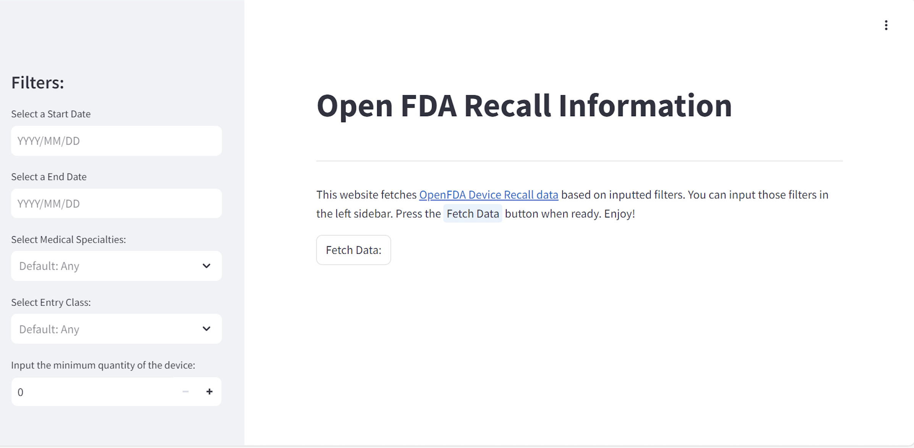
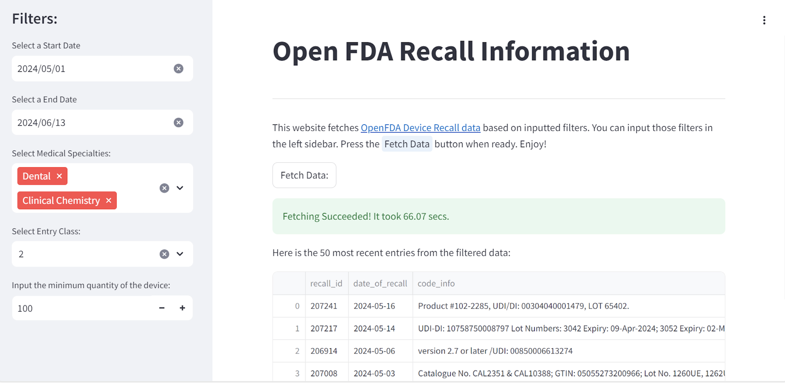

# OpenFDA Data Recall API

By: Andrew Xu

This project was part of my ICA Internship as an ML Engineer. The idea was to
familiarize myself with creating an API, connecting it with a frontend 
component.

## Description

**Objective:** Create an API that could process [OpenFDA Data](\
https://download.open.fda.gov/device/recall/device-recall-0001-of-0001.json.zip)
based on user input.

This project was entirely done using Python, with the focus on two libraries:
- `FastAPI`: The API component connecting the frontend with processed data
- `Streamlit`: Frontend website with various input parameters
I also used Docker to containerize the project.

If you want to test this for yourself, clone the project and download the 
OpenFDA data into the same folder as your project. Then, do 
`docker-compose up --build` to build the docker container.

## Example

Here is the page of the website before and after inputted filters:

